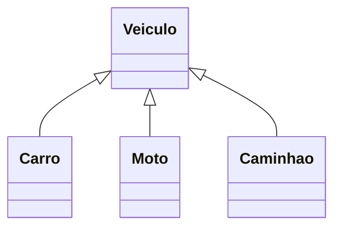
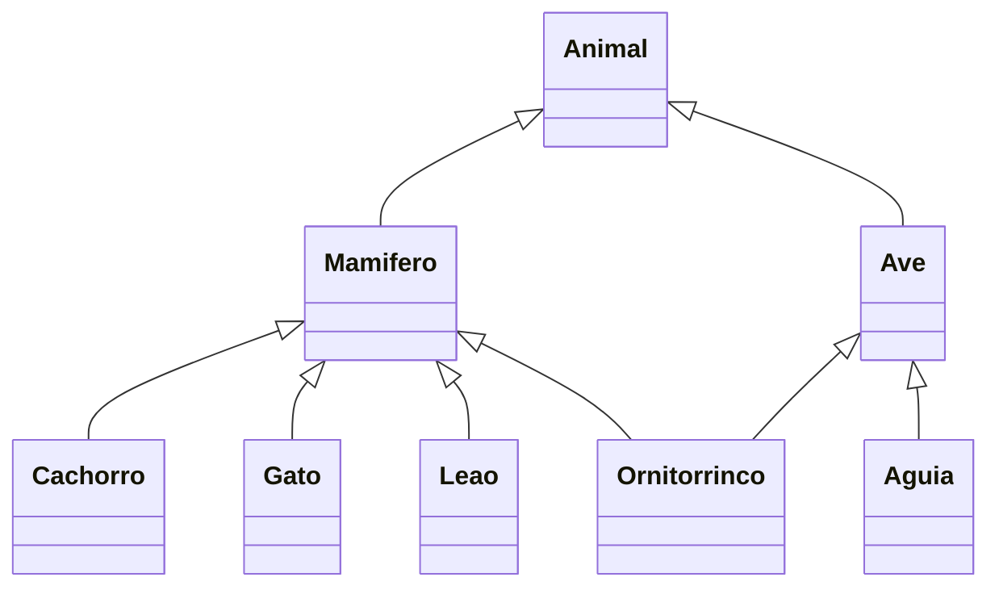

# Aprendendo o conceito de Herança em POO

Objetivo: Aprender o que é herança em POO e como podemos utilizá-la em Python

## Herança em POO

Em programação, herança é a capacidade de uma classe filha derivar ou herdar as características e comportamentos da classe pai (base).

#### Benefícios da herança
- Representa bem os relacionamentos do mundo real.
- Fornece reutilização de código, não precisamos escrever o mesmo código repetidamente. Além disso, permite adicionar mais recursos a uma classe sem modificá-la.
- É de natureza transitiva, o que significa que, se a classe B herdar da classe A, todas as subclasses de B herdarão automaticamente da classe A.

Para dizer ao Python que uma classe `B` herda os comportamentos de uma classe `A`, podemos seguir a sintaxe: `class B(A)`, sendo que o que estiver entre `()` é a classe que será herdada

>Este é um exemplo de herança simples
```py
class A:
    pass

class B(A): # A é a classe que será herdada
    pass
```

#### Herança simples e múltipla

|Herança simples|Herança múltipla|
|---------------|-----------------|
|Quando uma classe filha herda apenas uma classe pai, ela é chamada de herança simples.|Quando uma classe filha herda de várias classes pai, ela é chamada de herança múltipla.|

>NÃO são todas as linguagens que implementam a herança múltipla, por conta do seu problema de dependências cíclicas. Mas no caso do Python, é possível implementar 

```py
class A:
    pass

class B: 
    pass

class C(A, B): # C herda tanto da classe A quanto da classe B
    pass
```

## Prática - Herança simples
Agora, veremos na prática um exemplo de herança simples com Python. 

> Vale ressaltar que os exemplos são para fins acadêmcicos.

#### Diagrama de classes
Vamos utilizar este diagrama como base para nosso exemplo.
- Veiculo: É a classe-pai do exemplo. Todos os atributos/métodos descritos nela, serão aplicados para as classes filha
- Carro: É classe-filha de `Veiculo`. Repare que quando uma classe x herda comportamentos de outra classe y, podemos dizer que `x` É `y`. Ou seja, no nosso exemplo, `Carro` É um `Veiculo`  
-  Moto:
-  Caminhão:


---------------------------------------------------

### Código - Herança simples
Abaixo, uma implementação exemplo para esse diagrama de classes
```py
class Veiculo:
    def __init__(self, cor, placa, numero_rodas):
        self.cor = cor
        self.placa = placa
        self.numero_rodas = numero_rodas

    def ligar_motor(self):
        print("Ligando o motor...")

    def __str__(self):
        return f"{self.__class__.__name__}:{', '.join([f'{chave}={valor}' for chave, valor in self.__dict__.items()])}"

class Carro(Veiculo):
    pass

class Moto(Veiculo):
    pass

class Caminhao(Veiculo):

    def __init__(self, cor, placa, numero_rodas, carregado):
        super().__init__(cor, placa, numero_rodas)
        self.carregado = carregado

    def esta_carregado(self):
        print(f"{'Sim' if self.carregado else 'Não' "estou carregado"}")

civic = Carro("Preto", "ABC-1234", 4)
civic.ligar_motor()

honda = Moto("Vermelha", "ABC-0001", 2)
honda.ligar_motor()

caminhao = Caminhao("Prata", "ABC-1000", 6)
caminhao.ligar_motor()
caminhao.esta_carregado()
```
Vamos dividi-lo por partes para melhor explicação.

#### class Veiculo
Essa classe representa o veiculo. Como vimos anteriormente, ela possui o construtor com seus atributos para poder inicializar o objeto.
- Repare como os atributos de `Veiculo` são genéricos, ou seja, todos veículos possuem (cor, roda, placa, etc)
- Além disso, possui um método `ligar_motor` e `__str__` para exibir os atributos dinamicamente
```py
class Veiculo:
    def __init__(self, cor, placa, numero_rodas):
        self.cor = cor
        self.placa = placa
        self.numero_rodas = numero_rodas

    def ligar_motor(self):
        print("Ligando o motor...")

    def __str__(self):
        return f"{self.__class__.__name__}:{', '.join([f'{chave}={valor}' for chave, valor in self.__dict__.items()])}"
```

#### class Carro e Moto
Como essas classes são muito parecidas, vamos explicá-las juntas.
- Ambas as classes herdam de `Veiculo`. Isso implica que o python considera `Carro` e `Moto` como `Veiculo` (na vida real também consideramos), portanto, as classes podem utilizar os métodos `ligar_motor` e `__str__` sem nenhum problema.
- Para instanciar um objeto de `Carro`/`Moto` seguimos o mesmo padrão de repassar os argumentos definidos no construtor. Nesse caso, o construtor foi definido em `Veiculo`, então as classes herdeiras também têm acesso à ele.
- Vale ressaltar que a herança não te proíbe de criar coisas específicas para cada classe. Por exemplo, poderíamos definir um atributo/método que seja específico para motos (`usar_pezinho`, por exemplo) dentro da classe `Moto`, o mesmo serve para `Carro`. Veremos sobre isso mais a frente.
```py
class Carro(Veiculo):
    pass

class Moto(Veiculo):
    pass

civic = Carro("Preto", "ABC-1234", 4)
civic.ligar_motor() # Funciona, pois Carro herda de Veiculo

honda = Moto("Vermelha", "ABC-0001", 2)
honda.ligar_motor() # Funciona, pois Moto herda de Veiculo
```

#### class Veiculo
Essa classe traz alguns conceitos interessantes de sobrescrita:
- A classe Caminhao também herda de `Veiculo`, com o diferencial de que ela possui um atributo específico, o booleano `carregado`. O python permite sobrescrever a implementação de métodos. Isso significa que é possível "reaproveitar" o construtor de `Veiculo` para incluir o atributo `carregado`
- Por padrão, esse atributo não será inicializado na classe `Caminhao`, é necessário utilizar a palavra `super()` para chamar a implementação da classe-pai (`Veiculo`). A sintaxe é simples, utilizamos a palavra aliada ao método que queremos sobrescrever: `super().metodo()`
  - Como vamos sobrescrever o construtor de `Veiculo`, precisamos declarar os mesmos parâmetros + os atributos que queremos incluir em `Caminhao`. Em seguida, utilizamos `super().__init__(cor, placa, numero_rodas)` para que esses parâmetros sejam inicializados através do construtor da classe-pai. Já os atributos adicionais (exclusivos de `Caminhao`), é inicializado manualmente com o `self.atributo`
- Nesse caso, criamos o `Caminhao` com um atributo a mais que `Carro/Moto`. Além disso, ele possui um método específico `esta_carregado`. Isso significa que somente o `Caminhao` pode acessar esse método:
```py
class Caminhao(Veiculo):

    # Definimos um construtor com os mesmos atributos de Veiculo + atributos especificos de Caminhao (carregado)
    def __init__(self, cor, placa, numero_rodas, carregado):
        super().__init__(cor, placa, numero_rodas) # Chama o construtor da classe-pai
        self.carregado = carregado # Inicializa manualmente o atributo adicional de Caminhao

    def esta_carregado(self):
        print(f"{'Sim' if self.carregado else 'Não' "estou carregado"}")

caminhao = Caminhao("Prata", "ABC-1000", 6, True) # Repare como passamos um argumento a mais (True)
caminhao.ligar_motor()
caminhao.esta_carregado() # Funciona, pois o métodos é específico de Caminhao

civic.esta_carregado() # Não Funciona, pois Carro não possui nenhuma implementação deste método
honda.esta_carregado() # Não Funciona, pois Moto não possui nenhuma implementação deste método
```

--------------------------------------------------------------------

### Código - Herança Múltipla

Abaixo, uma implementação de herança múltipla em Python. Iremos usar como exemplo esse diagrama de classes

>Importante ressaltar que não teremos muitas diferenças em termos de sintaxe, então a explicação será mais conceitual.

#### Diagrama de classes - Herança múltipla
- Animal: Representa a classe-pai das de todas as outras classes. Essa classe vai conter todos os atributos/métodos que são pertencentes à todos animais, ou seja, são genéricos.
- Mamifero: Representa uma subclasse que herda de Animal. Essa classe vai representar os grupos de animais (objetos concretos) que são mamíferos. Além disso, ela vai conter os atributos/métodos que são pertencentes à todos os mamíferos.
  - Repare que aqui temos uma hierarquia de generalização que é importante ser entendida: `Animal` contém todos os atributos/métodos que são gerais para todos animais. `Mamifero` contém todos os atributos/métodos que são gerais para todos animais MAMÍFEROS. Ainda são atributos generalistas, porém são um pouco mais específicos do que os de `Animal`
  - Para ficar mais simples de entender: A medida que a hierarquia desce no diagrama, mais específico os atributos serão. 
- Ave: Representa uma subclasse que herda de Animal. Essa classe vai representar os grupos de animais (objetos concretos) que são aves
- Classes concretas: As demais classes abaixo serão os próprios animais
  - Cachorro, Gato e Leão: São objetos que herdam de `Mamifero` (e por conta da herança transitiva, também herdam de `Animal`)
  - Aguia: Objeto que herda de `Ave` (e por conta da herança transitiva, também herdam de `Animal`)
  - Ornitorrinco: Este é um caso interessante, pois o ornitorrinco é um animal considerado ave, mamífero e réptil (sim, os 3 grupos ao mesmo tempo). Não temos a representação de répteis no nosso diagraa para que não fique muito grande, mas nesse caso `Ornitorrinco` herda de `Mamifero` E `Ave` ao mesmo tempo

> Hierarquia de generalização: Animal representa o mais genérico, Mamifero é uma especialização. À medida que a hierarquia desce, os atributos e métodos se tornam mais específicos.


### Código - Herança múltiplas
Abaixo, uma implementação exemplo para esse diagrama de classes

>Como muitas estruturas (`super`, métodos/atributos exclusivos, chamada de métodos, etc) são semelhantes à herança simples, vamos explicar somente o que há de diferente.

- *Essa implementação possui alguns problemas conceituais que veremos mais a frente: 
```py
class Animal:
    def __init__(self, cor, numero_patas):
        self.cor = cor
        self.cor = numero_patas

    def __str__(self):
        return f"{self.__class__.__name__}:{', '.join([f'{chave}={valor}' for chave, valor in self.__dict__.items()])}"

# Subgrupo de mamíferos
class Mamifero(Animal):
    def __init__(self, cor, numero_patas):
        super().__init__(cor, numero_patas)

# Subgrupo de aves
class Ave(Animal):
    def __init__(self, cor, numero_patas, cor_bico):
        super().__init__(cor, numero_patas)
        self.cor_bico = cor_bico


# Animais mamíferos
class Cachorro(Mamifero):
    def latir(self):
        print("Au au au")

class Gato(Mamifero):
    def miar(self):
        print("Miau miau")

class Canguru(Mamifero):
    def pular(self):
        print("Pulando...")

# Animais aviários
class Aguia(Ave):
    def cacar(self):
        print("Caçando presa...")

# Ornitorrindo é Mamífero e Ave ao mesmo tempo
class Ornitorrinco(Mamifero, Ave):
    def botar_ovo(self):
        print("Botando ovo...")

    def nadar(self):
        print("Nadando")

# Intanciando objetos
bethoven = Cachorro("Preto", 4)
garfield = Gato("Laranja", 4)
canguru = Canguru("Marrom", 2)
aguia = Aguia("Preta", 2, "Amarelo")
ornitorrinco = Ornitorrinco("Marrom", 4, "Cinza")

# Acessando os métodos de cada objetos
bethoven.latir()
print(bethoven)

garfield.miar()
print(garfield)

canguru.pular()
print(canguru)

aguia.cacar()
print(aguia)

ornitorrinco.botar_ovo()
print(ornitorrinco)
```
#### class Mamifero e Ave - Ornitorrinco
Essas classes possuem um comportamento diferente em seus construtores:
- A classe `Animal` possui o argumento `numero_patas`. A clase `Mamifero` carrega o argumento `cor_pelo`, enquanto `Ave` carrega `cor_bico` (além de `numero_patas` pois ambas herdam de `Animal`). Por enquanto, nada diferente do que vimos, cada classe declara seu atributo específico no construtor e o inicializa, os atributos do construtor de `Animal` é repassado ao `super`.
```py
class Mamifero(Animal):
    def __init__(self, cor_pelo, numero_patas):
        self.cor_pelo = cor_pelo
        super().__init__(numero_patas)

class Ave(Animal):
    def __init__(self, cor_bico, numero_patas):
        self.cor_bico = cor_bico
        super().__init__(numero_patas)
``` 
- Porém, há um problema com essa estrutura: A classe `Ornitorrinco` possui herança múltipla com ambas as classes `Mamifero` e `Ave`. Isso faz com que um ornitorrinco tenha acesso tanto ao `cor_pelo` (de mamíferos) quanto `cor_bico` (de aves). Utilizando os construtores dessa maneira, teríamos um problema ao instanciar um ornitorrinco. Ele reclama justamente porque o construtor de `Mamifero` possui 2 argumentos, mas estamos passando 3:
```py
ornitorrinco = Ornitorrinco("Marrom", 4, "Cinza")

TypeError: Mamifero.__init__() takes 2 positional arguments but 3 were given
``` 
- Para resolver esse problema, teremos que usar os `keyargs`. Já vimos anteriormente que os keyargs permitem repassar parâmetros em forma dicionário (chave/valor) e é justamente isso que devemos fazer aqui. Nos construtores de `Mamifero` e `Ave`, devemos substituir o atributo referente à classe-pai (nesse caso, o `numero_patas`) por um keyarg `**kw`. Em seguida, devemos repassar o keyarg no `super()__init__(**kw)`, para que ele seja incorportado ao construtor da classe-pai:
```py
class Mamifero(Animal):
    # def __init__(self, cor_pelo, numero_patas):
    #     self.cor_pelo = cor_pelo
    #     super().__init__(numero_patas)
    
    def __init__(self, cor_pelo, **kw):
        self.cor_pelo = cor_pelo
        super().__init__(**kw)

class Ave(Animal):
    # def __init__(self, cor_bico, numero_patas):
    #     self.cor_bico = cor_bico
    #     super().__init__(numero_patas)
    
    def __init__(self, cor_bico, **kw):
        self.cor_bico = cor_bico
        super().__init__(kw)
```

- Quando usamos o keyargs, devemos repassar os argumentos de forma nomeada. Então ao instanciar um ornitorrinco, devemos repassar a chave/valor do parâmetro:
  - Vale ressaltar que essa mudança se aplica a TODOS os objetos. Ou seja, para instanciar qualquer objeto (Cachorro, Gato, Aguia, etc) devemos repassar os atributos de forma nomeada
```py
ornitorrinco = Ornitorrinco(numero_patas=4, cor_pelo="Marrom", cor_bico="Cinza")
```

>Como podemos ver nesse simples exemplo, herança múltipla é um recurso poderoso, porém pode ficar muito complexo se você aninhar muitas classes. Utilize com inteligência

#### Código corrigido
```py
class Animal:
    def __init__(self, numero_patas):
        self.numero_patas = numero_patas

    def __str__(self):
        return f"{self.__class__.__name__}:{', '.join([f'{chave}={valor}' for chave, valor in self.__dict__.items()])}"

# Subgrupo de mamíferos
class Mamifero(Animal):
    # def __init__(self, cor_pelo, numero_patas):
    #     self.cor_pelo = cor_pelo
    #     super().__init__(numero_patas)
    
    def __init__(self, cor_pelo, **kw):
        self.cor_pelo = cor_pelo
        super().__init__(**kw)

# Subgrupo de aves
class Ave(Animal):
    # def __init__(self, cor_bico, numero_patas):
    #     self.cor_bico = cor_bico
    #     super().__init__(numero_patas)
    
    def __init__(self, cor_bico, **kw):
        self.cor_bico = cor_bico
        super().__init__(**kw)


# Animais mamíferos
class Cachorro(Mamifero):
    def latir(self):
        print("Au au au")

class Gato(Mamifero):
    def miar(self):
        print("Miau miau")

class Canguru(Mamifero):
    def pular(self):
        print("Pulando...")

# Animais aviários
class Aguia(Ave):
    def cacar(self):
        print("Caçando presa...")

# Ornitorrindo é Mamífero e Ave ao mesmo tempo
class Ornitorrinco(Mamifero, Ave):
    def botar_ovo(self):
        print(Ornitorrinco.mro())
        print("Botando ovo...")

    def nadar(self):
        print("Nadando")

# Intanciando objetos
bethoven = Cachorro(cor_pelo="Preto", numero_patas=4)
garfield = Gato(cor_pelo="Laranja", numero_patas=4)
canguru = Canguru(cor_pelo="Marrom", numero_patas=2)
aguia = Aguia(cor_bico="Amarelo", numero_patas=2)
ornitorrinco = Ornitorrinco(numero_patas=4, cor_pelo="Marrom", cor_bico="Cinza")

# Acessando os métodos de cada objetos
bethoven.latir()
print(bethoven)

garfield.miar()
print(garfield)

canguru.pular()
print(canguru)

aguia.cacar()
print(aguia)

ornitorrinco.botar_ovo()
print(ornitorrinco)
```

> MRO: MRO significa Method Resolution Order, ou seja, Ordem de Resolução de Métodos. Em Python, quando uma classe herda de várias outras (herança múltipla), o MRO define a ordem exata em que o Python procura um método ou atributo quando você chama algo como `objeto.metodo()`.
```py
print(Ornitorrinco.mro())
>>> [<class '__main__.Ornitorrinco'>, <class '__main__.Mamifero'>, <class '__main__.Ave'>, <class '__main__.Animal'>, <class 'object'>]
```
- Esse resultado mostra a ordem que o Python segue para procurar métodos ou atributos em uma instância da classe Ornitorrinco.
1. Primeiro, procura na própria classe: Ornitorrinco
2. Depois em Mamifero
3. Depois em Ave
4. Depois em Animal
5. E por fim na classe base de todas em Python: object

