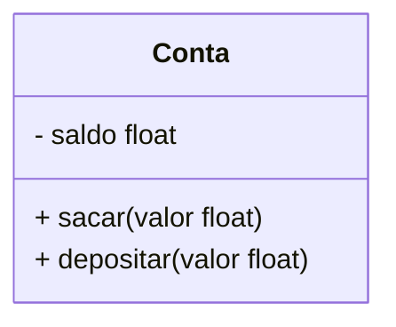

# Aplicando encapsulamento em Python

Objetivo: Entender o conceito de encapsulamento e como podemos apicá-lo utilizando Python

## O que é encapsulamento?

O encapsulamento é um dos conceitos fundamentais em
programação orientada a objetos. Ele descreve a ideia de agrupar dados e os métodos que manipulam esses dados em uma unidade. Isso impõe restrições ao acesso direto a variáveis e métodos e pode evitar a modificação acidental de dados.

Para evitar alterações acidentais, a variável de um objeto só pode ser alterada pelo método desse objeto.

>Quando falamnos de encapsulamento, estamos falando de proteção aos atributos de um objeto. 

Em um diagrama de classe, podemos identificar um atributo privado caso ele possua o caracterer `-`:
- No exemplo abaixo, a variável `saldo` é privada, enquantos os métodos `sacar` e `depositar` são métodos públicos (pois tem o caracter `+`) e serão utilizados para modificar a variável `saldo` 


---------------------------------------------------

## Recursos públicos e privados 

Em linguagens como Java e C++, existem palavras reservadas para definir o nível de acesso aos atributos e métodos da classe. 

Em Python não temos palavras reservadas, porém usamos convenções no nome do recurso, para definir se a variável é pública ou privada.

Essa convenção implica em utilizar o `_` no início do nome da variável, caso ela seja privada. Em caso de pública, não é necessário inserir nada.

#### Denifição
- Público: Pode ser acessado de fora da classe.
```py
class Conta:
    def __init__(self, saldo=0):
        self.saldo = saldo

print(conta.nome) # Com atributos públicos, podemos chamar o atributo/método fora da classe
```
- Privado: Só pode ser acessado pela classe.
```py
class Conta:
    def __init__(self, saldo):
        # Atributo privado
        self._saldo = saldo

print(conta.nome) # Com atributo privada, isso não pode ser feito. Seria necessário criar um método auxiliar para retornar o valor dessa variavel
```

>Importante ressaltar que diferentemente de outros compiladores, o Python não dá erro quando tentamos acessar uma variável privada. Como vimos anteriormente, definimos uma variável privada a somente partir de convenções.

Todos os recursos são públicos, a menos que o nome inicie com underline. Ou seja, o interpretador Python não irá garantir a proteção do recurso, mas por ser uma convenção amplamente adotada na comunidade, quando encontramos uma variável e/ou método com nome iniciado por underline, sabemos que não deveríamos manipular o seu valor diretamente, ou invocar o método fora do escopo da classe.

Por exemplo, o código abaixo vai funcionar, mas **NÃO** devemos fazer isso por conta de boas práticas.
- Não devemos acessar/modificar valores de variáveis privadas de forma direta
```py
# Isso será executado pelo compilador, mas NAO deve ser feito
print(conta._saldo)
conta._saldo += 100
```

Por ser uma variável privada, devemos acessá-la somente no escopo da classe. Então, utilize métodos invés de acesso direto:
```py
# Resto do código
    def depositar(self, valor):
        #...
        self._saldo += valor

    def mostrar_saldo(self):
        return self._saldo

conta = Conta(100)

# TROQUE ISSO ❌
conta._saldo += 100
print(conta._saldo)

# POR ISSO ✅
conta.depositar(100)
print(conta.mostrar_saldo())
```


---------------------------------------------------

## Properties

Com o `property()` do Python, você pode criar atributos gerenciados em suas classes. Você pode usar atributos gerenciados, também conhecidos como propriedades, quando precisar modificar sua implementação interna sem alterar a API pública da classe.

>Em outras palavras: você mantém a mesma "interface" para o usuário da classe, mas pode inserir lógica personalizada por trás dos bastidores.

#### Por que usar @property?
Use propriedades quando você:
- Quer proteger um atributo (evitar acesso direto sem controle)
- Precisa alterar a forma como um atributo é calculado ou armazenado
- Deseja manter a compatibilidade da sua API pública mesmo com mudanças internas


>Imagine que você possui uma variável nome, mas agora deseja que esse atributo retorne o nome completo, juntando nome e sobrenome. Com o @property, você pode fazer isso de forma automática:
- Você não precisa usar parênteses, pois @property transforma o método em um atributo calculado.
```py
class Pessoa:
    def __init__(self, nome, sobrenome):
        self._nome = nome
        self._sobrenome = sobrenome

    @property
    def nome_completo(self):
        return f"{self._nome} {self._sobrenome}"

p = Pessoa("João", "Silva")
print(p.nome_completo)
>>> João Silva
```

>Um decorador é uma função que recebe outra função ou método como argumento e retorna uma nova função que geralmente envolve (ou modifica) o comportamento da original.
- No caso do `@property`, o decorador transforma um método em um atributo de leitura, permitindo que você acesse o valor sem chamar explicitamente a função.


#### Exemplo
O exemplo abaixo ilustra a utilização dos `decorators`
- Construtor `__init__`: A classe `Foo` é possui um construtor que recebe um `numero`. Caso não seja passado nada, ele retorna `None`
- `@property`: Aqui, estamos definindo uma propriedade chamada `numero`. Esse método permite que numero seja acessado como se fosse um atributo normal, mesmo sendo uma função. 
  - A lógica implica que se `_numero` estiver com um valor válido, retorna ele. Caso contrário, retorna 0 (evitando retornar None).
- `@numero.setter`: Este método define o comportamento ao atribuir um valor à propriedade `numero`. Quando você faz `foo.numero = 10`, o Python executa esse método.
  - Ele soma o valor novo ao valor atual, tratando `None` como `0`
- `@numero.deleter`: Este método define o comportamento quando a propriedade `numero` é deletada usando `del` `foo.numero`. 
  - A lógica interna apenas atribui -1 ao atributo `_numero`, em vez de apagar completamente
```py
class Foo:
    def __init__(self, numero=None):
        self._numero = numero

    @property
    def numero(self):
        return self._numero or 0
    
    @numero.setter
    def numero(self, valor):
        _numero = self._numero or 0
        _valor = valor or 0
        self._numero = _numero + _valor

    @numero.deleter
    def numero(self):
        self._numero = -1

foo = Foo(10)
print(foo.numero) # Usando o @property -> 10 (como estamos usando a property, nao precisa usar () )

foo.numero = 10 # Usando o @numero.setter
print(foo.numero) # 10

del foo.numero # Usando o @numero.deleter
print(foo.numero) # -1
```

>Dica: Se o atributo não possui restrições para modificações, deixe ele publico e não crie `properties` ou `getter` para eles.