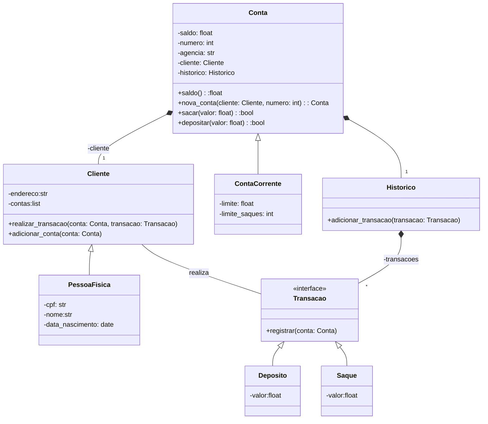

# Desafio de projeto - Criando um sistema bancário v3
Iniciar a modelagem do sistema bancário em POO. Adicionar classes para cliente e as operações bancárias: depósito e saque.

## Desafio
Atualizar a implementação do sistema bancário, para armazenar os dados de clientes e contas bancárias em objetos ao invés de dicionários. O código deve seguir o modelo de classes UML a seguir:

## Desafio extra
Após concluir a modelagem das classes e a criação dos métodos. Atualizar os métodos que tratam as opções do menu, para funcionarem com as classes modeladas.

## Separação em funções
Devemos criar funções para todas as operações do sistema. Para exercitar tudo o que aprendemos neste módulo, cada função vai ter uma regra na passagem de argumentos. O retorno e a forma como serão chamadas, pode ser definida por você da forma que achar melhor.

### Operação de saque 

A função saque deve receber os argumentos apenas por nome (keyword only). Sugestão de argumentos: saldo, valor, extrato, limite, numero_saques, limite_saques. Sugestão de retorno: saldo e extrato.

### Operação de depósito
A função depósito deve receber os argumentos apenas por posição (positional only). Sugestão de argumentos: saldo, valor, extrato. Sugestão de retorno: saldo e extrato.

### Operação de extrato
A função extrato deve receber os argumentos por posição e nome (positional only e keyword only). Argumentos posicionais: saldo, argumentos nomeados: extrato.

## Novas funções
Precisamos criar duas novas funções: criar usuário e criar conta corrente. Fique a vontade para adicionar mais funções, exemplo: listar contas.

### Criar usuário (cliente)
Precisamos criar duas novas funções: criar usuário e criar conta corrente. Fique a vontade para adicionar mais funções, exemplo: listar contas.

### Criar conta corrente

O programa deve armazenar contas em uma lista, uma conta é composta por: agência, número da conta e usuário. O número da conta é sequencial, iniciando em 1. O número da agência é fixo: "0001". O usuário pode ter mais de uma conta, mas uma conta pertence a somente um usuário.

>Dica: Para vincular um usuário a uma conta, filtre a lista de usuários buscando o número do CPF informado para cada usuário da lista.